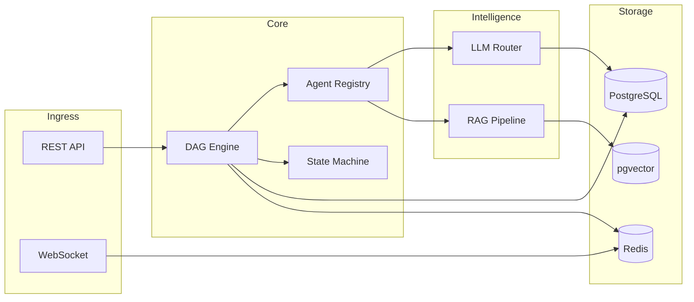

# NexusForge AI -- Architecture Document

## System Overview

NexusForge AI is built around a **DAG execution engine** that orchestrates specialized AI agents through multi-provider LLM routing, with document retrieval via RAG and real-time monitoring via WebSocket.



---

## DAG Engine

### Validation (dag.py)

The DAG validator uses **Kahn's algorithm** for topological sorting, which simultaneously:

1. Detects cycles (if sorted order length != step count, a cycle exists)
2. Validates all dependencies reference existing steps
3. Rejects duplicate step names
4. Requires at least one step

### Parallel Groups

After topological sort, steps are assigned a **depth level**:
- Steps with no dependencies: depth 0
- Steps with dependencies: `max(depth of dependencies) + 1`

Steps at the same depth form a **parallel group** and execute concurrently via `asyncio.gather()`.

Example for a diamond DAG `A -> B, A -> C, B+C -> D`:

```
Group 0: [A]        (sequential)
Group 1: [B, C]     (parallel)
Group 2: [D]        (sequential)
```

### State Machine (state_machine.py)

Two state machines govern execution:

**Workflow states:**
```
pending -> queued -> running -> completed
                            -> failed -> queued (retry)
                            -> cancelled
pending -> cancelled
queued -> cancelled
```

**Step states:**
```
pending -> running -> completed
                   -> failed -> retrying -> running
                   -> retrying
pending -> skipped
```

Invalid transitions raise `InvalidTransitionError` to prevent inconsistent state.

### Checkpoint & Resume (checkpoint.py)

Before executing each parallel group, the executor queries completed steps. This allows:
- Resuming interrupted workflows from the last checkpoint
- Skipping already-completed steps on retry
- No duplicate agent invocations

### Retry Policy (retry_policy.py)

Exponential backoff with jitter:
- `delay = min(base_delay * 2^attempt, max_delay)`
- Jitter: uniform random `[0, delay * 0.3]`
- Non-retryable errors: validation, unauthorized, forbidden, invalid
- Configurable per step via `retry_max` in StepDefinition

---

## Agent Framework

### Base Class (base.py)

All agents inherit from `BaseAgent` and implement `execute(input_data, config) -> AgentResult`:

```python
@dataclass
class AgentResult:
    output: dict          # Agent-specific structured output
    tokens_used: int      # LLM tokens consumed
    cost_usd: float       # Calculated cost
    provider: str         # Which LLM provider was used
    model: str            # Specific model name
```

### Registry (registry.py)

Agents self-register on import via `register_agent(type, instance)`. The registry maps string agent types to instances using a protocol-based interface.

### Agent Descriptions

| Agent       | Input                    | Output                                    |
|------------|--------------------------|-------------------------------------------|
| classifier | `{text}`                 | `{category, confidence, reasoning}`       |
| extractor  | `{text, schema}`         | `{entities, fields}`                      |
| summarizer | `{text, max_length}`     | `{summary, key_points}`                   |
| analyzer   | `{text, analysis_type}`  | `{sentiment, trends, anomalies}`          |
| enricher   | `{text, sources}`        | `{enriched_data, sources_used}`           |
| validator  | `{output, context}`      | `{is_valid, score, issues}`               |
| reporter   | `{results, format}`      | `{report, format}`                        |
| repair     | `{error, step_name}`     | `{diagnosis, fix_type, can_auto_fix}`     |

Each agent has a **demo mode** (`config.demo=true`) that returns deterministic output without LLM calls, and a **fallback path** that activates when the LLM router is unavailable.

---

## LLM Router

### Multi-Provider Routing (router.py)

The router tries providers in priority order:
1. **Groq** (fast, low cost) -- primary
2. **Claude** (high quality) -- fallback

### Circuit Breaker

Each provider has an independent circuit breaker:
- **Error threshold:** 3 errors within 60 seconds trips the circuit
- **Cooldown:** 30 seconds before the provider is retried
- **Reset:** successful call clears the error history

When a provider's circuit is open, the router skips it and tries the next. If all providers are exhausted, a `RuntimeError` is raised.

### Cost Tracking (token_tracker.py)

Every LLM response includes token counts. Cost is calculated per-provider:

| Provider | Input (per 1M tokens) | Output (per 1M tokens) |
|----------|-----------------------|------------------------|
| Groq     | $0.59                 | $0.79                  |
| Claude   | $3.00                 | $15.00                 |

Costs are attached to each `AgentResult` and aggregated at the workflow run level.

---

## RAG Pipeline

### Indexing (indexer.py)

1. **Chunking:** Text is split into overlapping chunks (default: 500 chars, 50 overlap)
2. **Embedding:** Chunks are embedded in batch via Voyage AI
3. **Storage:** Embeddings are stored in `document_chunks` table with pgvector

### Retrieval (retriever.py)

1. Query text is embedded using the same Voyage AI model
2. `match_chunks` PostgreSQL function performs cosine similarity search via pgvector
3. Top-K results are returned with similarity scores
4. `search_with_context()` builds a formatted context string for LLM consumption

---

## WebSocket Monitoring

### Connection Manager (manager.py)

- Clients connect to `/api/executions/ws/{run_id}`
- The manager maintains per-room (run_id) connection lists
- A background task subscribes to Redis pub/sub channel `run:{run_id}`
- Events are broadcast to all connected clients in real time

### Event Types

| Event           | Payload                                |
|----------------|----------------------------------------|
| `run_started`  | `{groups: int}`                        |
| `group_started`| `{group: int, steps: [str]}`           |
| `step_completed`| `{step, duration_ms, tokens}`         |
| `step_failed`  | `{step, duration_ms, tokens}`          |
| `run_completed`| `{total_tokens, total_cost_usd}`       |
| `run_failed`   | `{failed_step}`                        |

---

## Database Schema Overview

### Core Tables

- **workflows** -- workflow definitions with DAG JSON, versioning, soft-delete status
- **workflow_runs** -- execution instances with status, timing, cost aggregates
- **run_steps** -- individual step executions with input/output, retry count, tokens, cost
- **documents** -- uploaded documents with title, content, metadata, indexing status
- **document_chunks** -- chunked text with pgvector embeddings for similarity search

---

## Error Handling Strategy

### Layered Approach

1. **Step level:** RetryPolicy with exponential backoff handles transient errors
2. **Agent level:** Each agent has a fallback path returning heuristic results when LLM is unavailable
3. **Router level:** Circuit breaker prevents cascading failures across LLM providers
4. **Workflow level:** Failed steps trigger RepairAgent for diagnosis; self-healing where possible
5. **API level:** All routes wrap DB operations in try/except, returning appropriate HTTP status codes

### Dead Letter Handling

Steps that exceed `retry_max` are marked `failed`. The workflow run is also marked `failed` with the error message preserved. The RepairAgent can be invoked to analyze the failure and suggest:
- **retry** -- transient error, try again
- **reconfigure** -- change step config and retry
- **skip** -- mark step as skipped, continue workflow
- **escalate** -- requires human intervention
