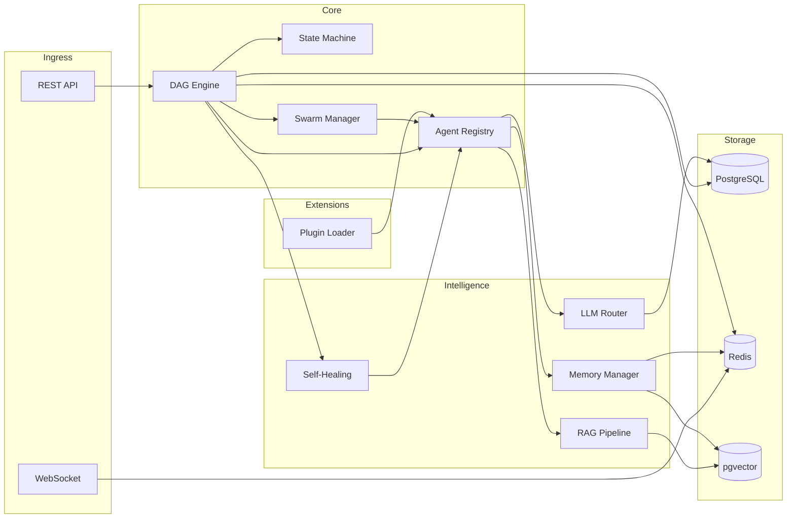
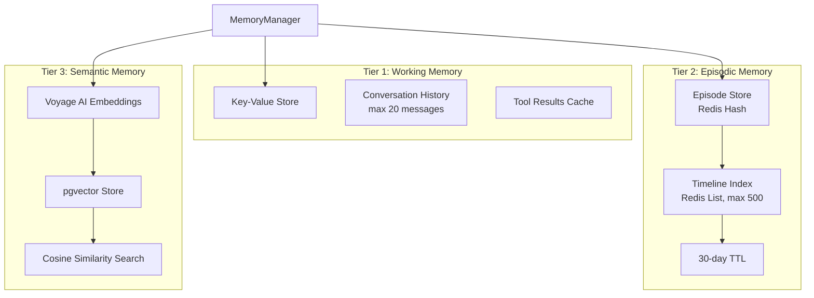
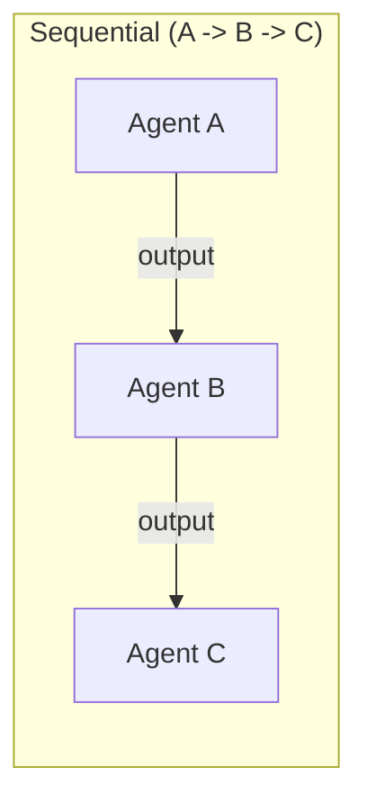
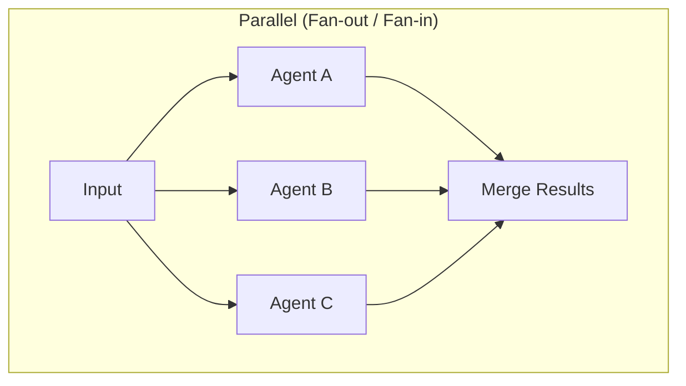
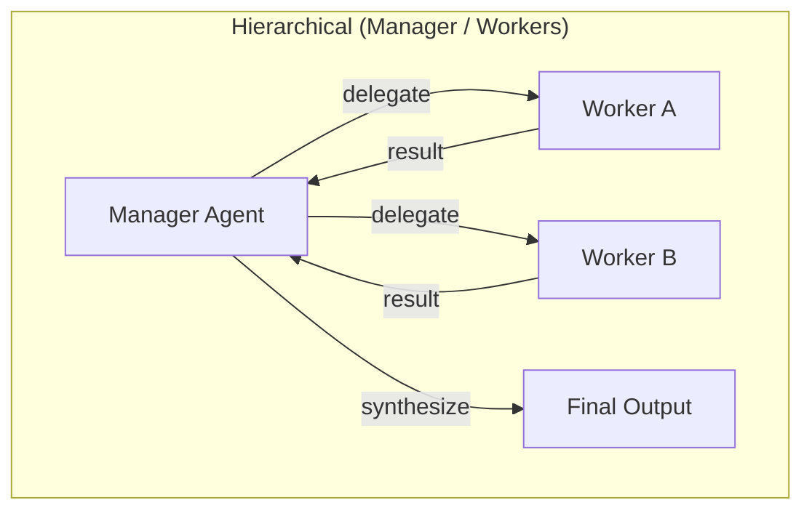
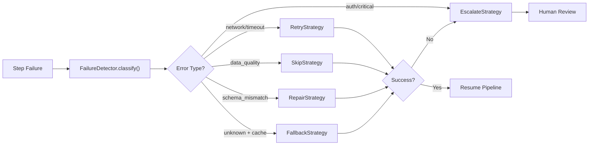
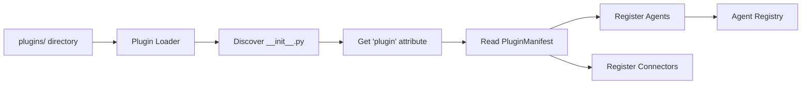

# NexusForge AI -- Architecture Document

## System Overview

NexusForge AI is built around a **DAG execution engine** that orchestrates 22 specialized AI agents through multi-provider LLM routing, 6 swarm topologies, a 3-tier memory system, self-healing pipelines, and a plugin architecture -- with document retrieval via RAG and real-time monitoring via WebSocket.



---

## DAG Engine

### Validation (dag.py)

The DAG validator uses **Kahn's algorithm** for topological sorting, which simultaneously:

1. Detects cycles (if sorted order length != step count, a cycle exists)
2. Validates all dependencies reference existing steps
3. Rejects duplicate step names
4. Requires at least one step

### Parallel Groups

After topological sort, steps are assigned a **depth level**:
- Steps with no dependencies: depth 0
- Steps with dependencies: `max(depth of dependencies) + 1`

Steps at the same depth form a **parallel group** and execute concurrently via `asyncio.gather()`.

Example for a diamond DAG `A -> B, A -> C, B+C -> D`:

```
Group 0: [A]        (sequential)
Group 1: [B, C]     (parallel)
Group 2: [D]        (sequential)
```

### State Machine (state_machine.py)

Two state machines govern execution:

**Workflow states:**
```
pending -> queued -> running -> completed
                            -> failed -> queued (retry)
                            -> cancelled
pending -> cancelled
queued -> cancelled
```

**Step states:**
```
pending -> running -> completed
                   -> failed -> retrying -> running
                   -> retrying
pending -> skipped
```

Invalid transitions raise `InvalidTransitionError` to prevent inconsistent state.

### Checkpoint & Resume (checkpoint.py)

Before executing each parallel group, the executor queries completed steps. This allows:
- Resuming interrupted workflows from the last checkpoint
- Skipping already-completed steps on retry
- No duplicate agent invocations

### Retry Policy (retry_policy.py)

Exponential backoff with jitter:
- `delay = min(base_delay * 2^attempt, max_delay)`
- Jitter: uniform random `[0, delay * 0.3]`
- Non-retryable errors: validation, unauthorized, forbidden, invalid
- Configurable per step via `retry_max` in StepDefinition

---

## Agent Framework (22 Agents)

### Base Class (base.py)

All agents inherit from `BaseAgent` and implement `execute(input_data, config) -> AgentResult`:

```python
@dataclass
class AgentResult:
    output: dict          # Agent-specific structured output
    tokens_used: int      # LLM tokens consumed
    cost_usd: float       # Calculated cost
    provider: str         # Which LLM provider was used
    model: str            # Specific model name
```

### Registry (registry.py)

Agents self-register on import via `register_agent(type, instance)`. The registry maps string agent types to instances using a protocol-based interface.

### Agent Catalog (22 Core Agents)

| Agent         | Type           | Input                     | Output                                    |
|--------------|----------------|---------------------------|-------------------------------------------|
| Classifier   | `classifier`   | `{text}`                  | `{category, confidence, reasoning}`       |
| Extractor    | `extractor`    | `{text, schema}`          | `{entities, fields}`                      |
| Summarizer   | `summarizer`   | `{text, max_length}`      | `{summary, key_points}`                   |
| Analyzer     | `analyzer`     | `{text, analysis_type}`   | `{sentiment, trends, anomalies}`          |
| Enricher     | `enricher`     | `{text, sources}`         | `{enriched_data, sources_used}`           |
| Validator    | `validator`    | `{output, context}`       | `{is_valid, score, issues}`               |
| Reporter     | `reporter`     | `{results, format}`       | `{report, format}`                        |
| Repair       | `repair`       | `{error, step_name}`      | `{diagnosis, fix_type, can_auto_fix}`     |
| Normalizer   | `normalizer`   | `{data, schema}`          | `{normalized, deduped}`                   |
| Researcher   | `researcher`   | `{topic}`                 | `{summary, citations}`                    |
| Translator   | `translator`   | `{text, target_lang}`     | `{translated, source_lang}`               |
| Compliance   | `compliance`   | `{text, rules}`           | `{issues, risk_level}`                    |
| Monitor      | `monitor`      | `{metrics}`               | `{health, anomalies}`                     |
| Router Agent | `router_agent` | `{task}`                  | `{recommended_agents, reasoning}`         |
| Critic       | `critic`       | `{output}`                | `{score, critique, suggestions}`          |
| Planner      | `planner`      | `{task}`                  | `{plan, estimated_steps, complexity}`     |
| Knowledge    | `knowledge`    | `{question}`              | `{answer, sources}`                       |
| Scraper      | `scraper`      | `{url, selectors}`        | `{data, metadata}`                        |
| OCR          | `ocr`          | `{image}`                 | `{text, confidence}`                      |
| Sentiment    | `sentiment`    | `{text}`                  | `{sentiment, score, emotions, topics}`    |
| Scheduler    | `scheduler`    | `{tasks}`                 | `{schedule, order}`                       |
| Webhook      | `webhook`      | `{url, payload}`          | `{status, response}`                      |

Each agent has a **demo mode** (`config.demo=true`) that returns deterministic output without LLM calls, and a **fallback path** that activates when the LLM router is unavailable.

---

## Memory System (3 Tiers)

The memory system gives agents persistent context across executions. Three tiers trade off speed for persistence and richness.

### Architecture Diagram



### Tier Details

| Tier | Name     | Backend    | Lifetime         | Access Speed | Capacity          |
|------|----------|-----------|------------------|--------------|-------------------|
| 1    | Working  | In-process dict | Execution scope | Microseconds | Per-execution     |
| 2    | Episodic | Redis     | 30-day TTL       | Milliseconds | 500 episodes/agent|
| 3    | Semantic | pgvector  | Permanent        | ~10ms        | Unlimited         |

### Unified API (manager.py)

The `MemoryManager` wraps all three tiers behind a single interface:

- **`remember(agent_id, text, tier)`** -- Store to one or more tiers (comma-separated)
- **`recall(agent_id, query, tiers)`** -- Search across specified tiers
- **`build_context(agent_id, task)`** -- Combine relevant memories from all tiers into a single LLM prompt context

### Working Memory Internals

- `_store`: arbitrary key-value dict for task context
- `_conversation`: bounded deque (max 20 messages) for conversation history
- `_tool_results`: maps tool names to their latest results
- `get_context_string()`: combines all three into a formatted string showing `[Task Context]`, `[Recent Messages]` (last 5), and `[Tool Results]`

### Cross-Agent Knowledge Transfer

Semantic memory supports `share_knowledge(from_agent, to_agent, text)` for agents to pass learned insights to other agents across different executions.

---

## Swarm Topologies (6)

Swarms coordinate multiple agents to solve complex tasks. The `SwarmManager` provides a registry of topology implementations.

### Topology Descriptions







| Topology       | Class              | Pattern                                              | Use Case                                |
|---------------|--------------------|------------------------------------------------------|-----------------------------------------|
| `sequential`  | `SequentialSwarm`  | A -> B -> C: output chains                           | Document processing pipelines           |
| `parallel`    | `ParallelSwarm`    | Fan-out/fan-in: all agents run simultaneously        | Multi-perspective analysis              |
| `hierarchical`| `HierarchicalSwarm`| Manager delegates to workers, synthesizes results    | Complex multi-step tasks                |
| `debate`      | `DebateSwarm`      | Agents argue positions, judge selects winner         | Decision-making, critical analysis      |
| `consensus`   | `ConsensusSwarm`   | Independent processing, then voting to merge         | Reliability-critical outputs            |
| `adaptive`    | `AdaptiveSwarm`    | Router dynamically selects agents per input          | Heterogeneous input processing          |

### SwarmResult

Every topology returns a unified `SwarmResult`:

```python
@dataclass
class SwarmResult:
    output: dict              # Combined agent outputs
    topology: str             # Which topology was used
    agents_used: list[str]    # Agents that successfully executed
    total_tokens: int         # Sum of all token usage
    total_cost: float         # Sum of all costs (USD)
    steps_executed: int       # Number of successful steps
    duration_ms: int          # Wall-clock time
```

---

## Self-Healing System

The self-healing system automatically detects, classifies, and recovers from pipeline failures without human intervention (when possible).

### Healing Flow



### Error Classification (detector.py)

The `FailureDetector` uses regex pattern matching to classify error messages:

| Pattern Match                      | Error Type        | Severity | Recoverable | Action   |
|-----------------------------------|-------------------|----------|-------------|----------|
| connection, refused, socket, DNS   | `network`         | medium   | Yes         | retry    |
| timeout, timed out, deadline       | `timeout`         | medium   | Yes         | retry    |
| rate limit, 429, throttle          | `network`         | low      | Yes         | retry    |
| 401, 403, unauthorized, forbidden  | `network`         | critical | No          | escalate |
| schema, validation, parse error    | `schema_mismatch` | medium   | Yes         | repair   |
| empty, missing, null, 404          | `data_quality`    | low      | Yes         | skip     |
| content filter, context length     | `llm_error`       | medium   | Yes         | retry    |
| memory, OOM, resource              | `llm_error`       | high     | No          | escalate |
| (no match, informative message)    | `unknown`         | high     | Yes         | repair   |
| (no match, short message)          | `unknown`         | high     | No          | escalate |

### Recovery Strategies (strategies.py)

| Strategy        | Class              | Behavior                                                                |
|----------------|--------------------|-------------------------------------------------------------------------|
| **Retry**      | `RetryStrategy`    | Re-execute with lower temperature (-0.2) and more tokens (+512)         |
| **Skip**       | `SkipStrategy`     | Return default output (`{_skipped: true}`) and continue pipeline        |
| **Repair**     | `RepairStrategy`   | Invoke RepairAgent for diagnosis; if auto-fixable, re-execute with fix  |
| **Escalate**   | `EscalateStrategy` | Mark step for human review; pipeline pauses                             |
| **Fallback**   | `FallbackStrategy` | Use cached result from a previous successful run of the same step       |

All strategies return a `HealingResult(success, strategy_used, output, message)`.

### Learning Loop

The healing system feeds outcomes back into episodic memory, allowing agents to learn from past failures:
1. Error is classified and strategy is selected
2. Strategy is applied; result is recorded
3. Success/failure is stored as an episodic memory episode
4. Future classification can reference past patterns via `EpisodicMemory.get_patterns()`

---

## Plugin Architecture

### Overview

NexusForge supports runtime-extensible plugins that provide custom agents and data connectors without modifying core code.



### Plugin Contract

Every plugin must:
1. Implement `NexusPlugin` abstract base class
2. Expose a module-level `plugin` attribute (the plugin instance)
3. Implement `get_manifest()` returning a `PluginManifest`
4. Implement `register(agent_registry, connector_registry)` to register its components

### PluginManifest

```python
@dataclass
class PluginManifest:
    name: str                          # Unique plugin identifier
    version: str                       # Semantic version
    description: str                   # What the plugin does
    author: str                        # Author or team
    agent_types: list[str] = []        # Agent types this plugin provides
    connectors: list[str] = []         # Data connectors it adds
```

### Plugin Discovery (loader.py)

- `load_plugin(path)` -- load a single plugin from a directory
- `load_all_plugins(plugins_dir)` -- scan a directory and load all valid plugins
- `list_plugins()` -- return manifests of all currently loaded plugins

The loader adds the plugin's parent directory to `sys.path` so relative imports within the plugin work correctly.

---

## LLM Router

### Multi-Provider Routing (router.py)

The router tries providers in priority order:
1. **Groq** (fast, low cost) -- primary
2. **Claude** (high quality) -- fallback

### Circuit Breaker

Each provider has an independent circuit breaker:
- **Error threshold:** 3 errors within 60 seconds trips the circuit
- **Cooldown:** 30 seconds before the provider is retried
- **Reset:** successful call clears the error history

When a provider's circuit is open, the router skips it and tries the next. If all providers are exhausted, a `RuntimeError` is raised.

### Cost Tracking (token_tracker.py)

Every LLM response includes token counts. Cost is calculated per-provider:

| Provider | Input (per 1M tokens) | Output (per 1M tokens) |
|----------|-----------------------|------------------------|
| Groq     | $0.59                 | $0.79                  |
| Claude   | $3.00                 | $15.00                 |

Costs are attached to each `AgentResult` and aggregated at the workflow run level.

---

## RAG Pipeline

### Indexing (indexer.py)

1. **Chunking:** Text is split into overlapping chunks (default: 500 chars, 50 overlap)
2. **Embedding:** Chunks are embedded in batch via Voyage AI
3. **Storage:** Embeddings are stored in `document_chunks` table with pgvector

### Retrieval (retriever.py)

1. Query text is embedded using the same Voyage AI model
2. `match_chunks` PostgreSQL function performs cosine similarity search via pgvector
3. Top-K results are returned with similarity scores
4. `search_with_context()` builds a formatted context string for LLM consumption

---

## WebSocket Monitoring

### Connection Manager (manager.py)

- Clients connect to `/api/executions/ws/{run_id}`
- The manager maintains per-room (run_id) connection lists
- A background task subscribes to Redis pub/sub channel `run:{run_id}`
- Events are broadcast to all connected clients in real time

### Event Types

| Event           | Payload                                |
|----------------|----------------------------------------|
| `run_started`  | `{groups: int}`                        |
| `group_started`| `{group: int, steps: [str]}`           |
| `step_completed`| `{step, duration_ms, tokens}`         |
| `step_failed`  | `{step, duration_ms, tokens}`          |
| `run_completed`| `{total_tokens, total_cost_usd}`       |
| `run_failed`   | `{failed_step}`                        |

---

## Database Schema Overview

### Core Tables

- **workflows** -- workflow definitions with DAG JSON, versioning, soft-delete status
- **workflow_runs** -- execution instances with status, timing, cost aggregates
- **run_steps** -- individual step executions with input/output, retry count, tokens, cost
- **documents** -- uploaded documents with title, content, metadata, indexing status
- **document_chunks** -- chunked text with pgvector embeddings for similarity search (also used by semantic memory)

---

## Error Handling Strategy

### Layered Approach

1. **Step level:** RetryPolicy with exponential backoff handles transient errors
2. **Agent level:** Each agent has a fallback path returning heuristic results when LLM is unavailable
3. **Router level:** Circuit breaker prevents cascading failures across LLM providers
4. **Healing level:** FailureDetector classifies errors; strategies (retry, skip, repair, fallback, escalate) attempt recovery
5. **Workflow level:** Failed steps trigger RepairAgent for diagnosis; self-healing where possible
6. **API level:** All routes wrap DB operations in try/except, returning appropriate HTTP status codes

### Dead Letter Handling

Steps that exceed `retry_max` are marked `failed`. The workflow run is also marked `failed` with the error message preserved. The self-healing system can be invoked to analyze the failure and select from 5 strategies:
- **retry** -- transient error, re-execute with modified config
- **repair** -- invoke RepairAgent to diagnose and fix
- **skip** -- use default output and continue pipeline
- **fallback** -- use cached result from previous run
- **escalate** -- requires human intervention
